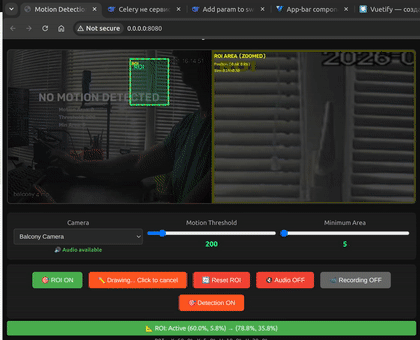

<!-- 
# make gif
ffmpeg -i input.mkv -vf "fps=5,scale=420:-1:flags=lanczos,split[s0][s1];[s0]palettegen[p];[s1][p]paletteuse" output.gif 
-->


# Open CV Motion Detection System

## 📋 Описание проекта

Система детекции движения с веб-интерфейсом для наблюдения за IP-камерами. Проект предоставляет возможность просмотра видеопотока в реальном времени, обнаружения движения с настраиваемой чувствительностью, автоматической записи видео при обнаружении движения, а также управления областями интереса (ROI).




> **⚠️ Внимание:** Проект находится в стадии активной разработки. Некоторые функции могут быть нестабильны или находиться в процессе реализации.

## 📌 Текущий статус разработки

### ✅ Реализовано
- [x] Базовый MJPEG-стриминг
- [x] Детекция движения с MOG2
- [x] Автоматическая запись видео
- [x] Аудио-поток (через FFmpeg)
- [x] Переключение между камерами
- [x] ROI (Region of Interest)
- [x] SSE события для статуса
- [x] Веб-интерфейс
- [x] Типизация кода (mypy)

### 🚧 В разработке
- [ ] Стабильное рисование ROI на UI и сохранение
- [ ] Улучшенная обработка ошибок
- [ ] Более точная настройка чувствительности
- [ ] Поддержка нескольких потоков одновременно
- [ ] Уведомления о движении (Telegram/Email)
- [ ] Улучшенный веб интерфейс

### Известные проблемы
- Иногда возникают ошибки сериализации ROI в SSE событиях
- При переключении камеры может быть кратковременная потеря потока

## ✨ Основные возможности

- **Просмотр видео в реальном времени** - MJPEG-стриминг с поддержкой нескольких камер
- **Детекция движения** - На основе алгоритма вычитания фона (MOG2) с настраиваемыми параметрами
- **Автоматическая запись** - Сохранение видео при обнаружении движения с буферизацией
- **Аудио-поддержка** - Потоковая передача аудио с камер (при наличии)
- **ROI (Region of Interest)** - Выделение области интереса для детекции движения
- **Переключение камер** - Быстрая смена камер без перезапуска сервера
<!-- - **Статус в реальном времени** - SSE-события для отображения статуса детекции -->

## 🏗️ Архитектура

```
opencv_motion_detect/
├── main.py                 # Точка входа, настройка FastAPI
├── api_routes.py           # API эндпоинты
├── config.py               # Конфигурация (камеры, параметры)
├── models.py               # Pydantic модели для валидации
├── app_state.py            # Состояние приложения (Singleton)
├── motion_detector.py      # Основная логика детекции движения
├── roi_manager.py          # Управление областями интереса
├── video_recorder.py       # Запись видео
├── audio_streamer.py       # Потоковая передача аудио
├── static/                 # Статические файлы (HTML, CSS, JS)
├── recordings/             # Директория с записями
└── requirements.txt        # Зависимости
```

## 🚀 Установка и запуск

### Требования

- Python 3.11+
- OpenCV
- FFmpeg (для аудио-поддержки)
- IP-камера с RTSP-потоком


<!-- 
### Установка

```bash
# Клонирование репозитория
git clone <repository-url>
cd opencv_motion_detect

# Создание виртуального окружения
python -m venv venv
source venv/bin/activate  # Linux/Mac
# или
venv\Scripts\activate     # Windows

# Установка зависимостей
pip install -r requirements.txt
``` -->

### Настройка камер

В файле `config.py` настройте параметры камер:

```python
self.CAMERAS = {
    "Название камеры": {
        "url": "rtsp://ip:port/stream",
        "has_audio": True
    },
    # Добавьте свои камеры
}
```

### Запуск

```bash
python main.py
```

Сервер будет доступен по адресу: `http://localhost:8080`

## 📡 API Эндпоинты

| Метод | Эндпоинт | Описание |
|-------|----------|----------|
| GET | `/` | Главная страница |
| GET | `/api/cameras` | Список доступных камер |
| GET | `/stream.mjpg` | MJPEG видеопоток |
| GET | `/events` | SSE события (статус детекции) |
| GET | `/audio.wav` | Аудиопоток (WAV) |
| POST | `/switch_camera` | Переключение камеры |
| POST | `/toggle_recording` | Вкл/Выкл запись |
| POST | `/toggle_detection` | Вкл/Выкл детекцию |
| GET | `/motion_status` | Текущий статус детекции |
| GET | `/roi/{camera_name}` | Получить ROI для камеры |
| POST | `/roi/set` | Установить ROI |
| POST | `/roi/reset/{camera_name}` | Сбросить ROI |

## ⚙️ Параметры настройки

### Параметры детекции

- **Motion Threshold** - Порог чувствительности (по умолчанию: 200)
- **Min Area** - Минимальная площадь движения (по умолчанию: 5)

### Параметры записи

- `RECORD_BUFFER_SECONDS` - Буфер перед записью (2 сек)
- `RECORD_AFTER_SECONDS` - Запись после окончания движения (3 сек)
- `MIN_RECORD_SECONDS` - Минимальная длина записи (3 сек)
- `MAX_RECORD_SECONDS` - Максимальная длина записи (300 сек)


## 🖥️ Веб-интерфейс

Веб-интерфейс предоставляет:

- Просмотр видеопотока в реальном времени
- Панель управления детекцией
- Настройка параметров детекции (порог, минимальная площадь)
- Управление записью
- Отображение статуса детекции
- Настройка ROI через графический интерфейс

## 🎯 Алгоритм детекции движения

1. **Захват кадра** - Получение кадра из RTSP-потока
2. **Предобработка** - Изменение размера, применение ROI
3. **Вычитание фона** - Использование MOG2 для выделения движущихся объектов
4. **Анализ контуров** - Поиск контуров движущихся объектов
5. **Фильтрация** - Отсев объектов меньше `min_area`
6. **Принятие решения** - Если площадь движения > `threshold`, фиксируется движение
7. **Запись** - Автоматический старт/стоп записи при обнаружении движения

## 🔧 Возможные проблемы и решения

### Проблема: Ошибка детекции
**Решение:** Настройте параметры `threshold` и `min_area` под ваши условия

## 🛠️ Разработка

### Запуск в режиме разработки

```bash
python main.py
```

### Запуск mypy для проверки типов

```bash
mypy .
```

## 📄 Лицензия

MIT License